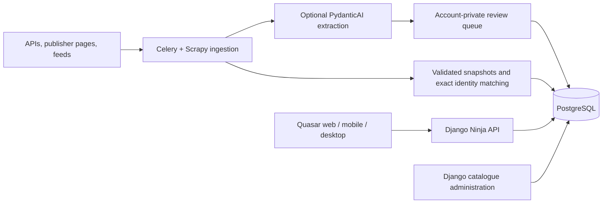

# Architecture and invariants

The client, API, and ingestion workers run independently. Clients never hold provider credentials for background collection. A single Celery scheduler queues catalogue refreshes and feed checks; the worker continues while all clients are closed.

## Catalogue and evidence

`Franchise` groups stories; `Work` identifies a particular medium/adaptation; `Unit` retains a provider's episode/chapter ID and numbering; `Edition` keeps publisher product ID, ISBN, format, and language distinct. `ExternalIdentity` maps an application UUID to a unique `(provider, namespace, external_id)` tuple. Provider identifiers are strings, including Kakuyomu IDs beyond JavaScript's safe integer range.

Publisher records currently identify individual volumes/products. Link those works into a franchise or add typed `part_of`/adaptation/sequel relationships through curation; title similarity never silently combines editions or adaptations. Following related works expands only resolved, reported/confirmed catalogue relationships. Unknown Bangumi relation candidates remain in source metadata until their target is imported or curated.

`SourceDocument` versions fetched metadata/article text by scope, URL, and content hash. `Claim` records its source location and supporting text. `Event` has a stable source key, precision/window, region, platform, language, verification, and lifecycle. `EventRevision` keeps changed projections rather than replacing their history.

Publication and observation are different timestamps. Exact instants are filtered and grouped in the client’s display timezone; date-only and partial release windows keep their source calendar dates. An announcement with an explicit future window produces an announcement occurrence at the known publication time and a separate release projection. Undated sequel/adaptation projections stay in TBA. Missing publication dates never become invented announcement timestamps; the publication/observation view labels its fallback as an observation. TMDB watch-provider observations do not establish original release dates.

## Collection contract

An adapter supplies `resolve`, `search`, `fetch_snapshot`, and `diff`. Snapshots are Pydantic-validated and declare completeness and diagnostics. Source fetches have time/size limits and exact host allowlists; redirects are revalidated. Scrapy obeys robots rules and throttles requests. Playwright is used only when HTML metadata is incomplete and restricts subrequests as well.

The worker obtains a short database lease, collects outside a transaction, then applies a complete snapshot in an atomic transaction. HTTP outages and rate limits retry with increasing delays. Parsing failures preserve the last successful snapshot and are visible in Sources. The scheduler respects hourly serial/feed checks and six-hour catalogue intervals.

Kakuyomu reconciliation compares chapter IDs and fields independently for additions, edits, order changes, and removals. One complete missing observation retains a chapter; a second confirms removal. Incomplete indexes do not update the baseline or removal counter. Metadata changes become audit events, not chapter releases. Chapter text is never requested.

## Access and extraction

Shared catalogue/source-derived events are visible to authenticated accounts. Progress, follows, filters, feed subscriptions, ingestion submissions, model settings, and reviewed claims are scoped to the authenticated owner. API tokens are random, stored hashed, expire after seven days, and are revoked on logout. Model credentials use Fernet encryption and are never returned by the API.

BYOM consumes bounded article text as untrusted input, offers no tools, validates structured output, and requires a supporting quotation from the collected text. It has an atomic per-account daily limit, one agent model invocation per charged slot, an output token cap, and a request timeout. Model suggestions cannot update shared events. The review endpoint locks each proposal and accepts one approval/rejection only.

## Extension points

Add an adapter to `tracker/ingestion/registry.py` with fixture tests. Add a source domain through configuration only after identifying why it is needed. Source policy/attribution belongs beside the adapter, independently of its code's library licence. New event/relationship types must update the domain contracts, API models, generated types, and filters together. Keep any future automatic cross-provider matching as a proposal until the user or curator resolves ambiguity.
